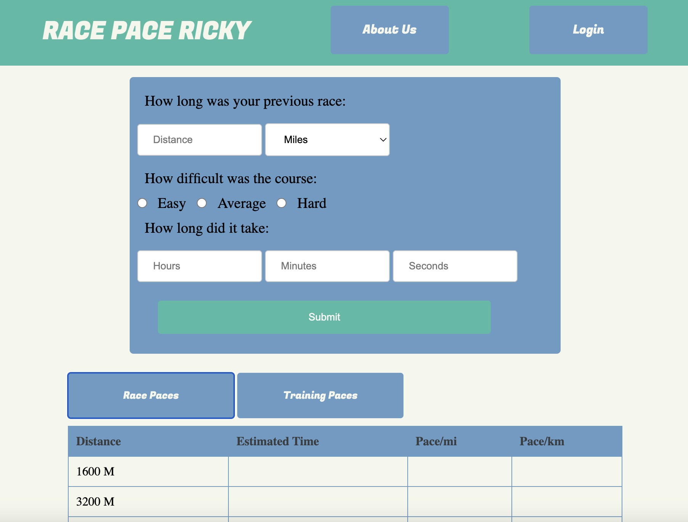

# RacePaceRicky

## Summary

#### Race Pace Ricky is a simple footrace preditor that uses Peter Reigels distance running formula to predict equivalent preformances over several distances.

#### Users can enter a previous race, and will recive two tables, one with estimated race preformances for popular distances, the other with reccomended training paces for various workouts

## Tech Stack

- Javascript
- Node.js
- Axios
- Express
- Sequelize
- Cypress
- HTML
- CSS

## Setup

- run npm i
- start server with nodemon or node server/server.js
- visit localhost 5050 in a browser

